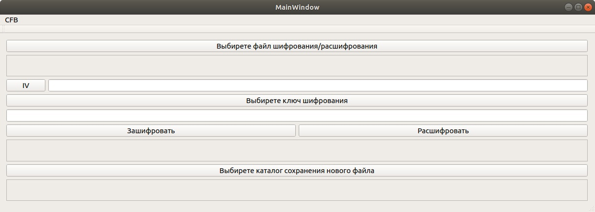
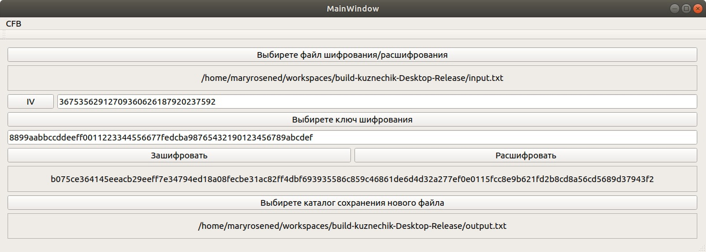
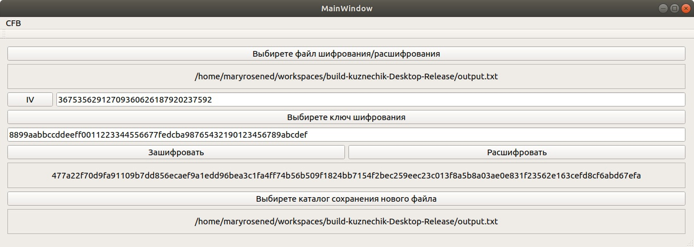

# Кузнечик 
  Разработка прикладное ПО для зашифрования/расшифрования файлов с использованием алгоритма ГОСТ Р 34.13—2015 в режиме гаммирования с обратной связью по шифртексту. 

# Задание: 
  Разработать прикладное ПО для зашифрования/расшифрования файлов с использованием алгоритма ГОСТ Р 34.13—2015 в режиме гаммирования с обратной связью по шифртексту. Реализацию алгоритма можно заимствовать. ПО должно иметь графический пользовательский интерфейс (GUI) для указания зашифровываемых/расшифровываемых файлов, файла с ключом шифрования и каталога для сохранения зашифрованных/расшифрованных файлов. В качестве значений синхропосылки использовать значения полученные с помощью любого генератора псевдослучайной последовательности (например rand()). При разработке использовать язык программирования С++ в ООП стиле. Для создания GUI использовать библиотеку классов Qt. В приложении эталонная реализация криптоалгоритма. 

# Реализация алгоритма:
  За реализацию алгоритма был взята следующая [статья](https://habr.com/ru/post/313932/).

  Реализация имеет следующие возможности:
  * Алгоритм блочного шифрования Kuznyechik с длиной блока 128 бит и длиной ключа 256 бит
  * Режим шифрования с обратной связью по шифротексту

# Реализация графического пользовательского интерфейса: 

Начальный экран программы
<p align="center">

</p>

> При нажатии кнопки "IV", в текстовом поле справа отображается значения синхропосылки, полученных с помощью генератора псевдослучайной последовательности rand().
> Есть возможность записать свои значения синхропосылки и ключа шифрования! 

Программа, получившая результат
<p align="center">

</p>

> В качестве входных данных использовался текстовый файл input.txt со следующими данными: 
```bash
477a22f70d9fa91109b7dd856ecaef9a1edd96bea3c1fa4ff74b56b509f1824bb7154f2bec259eec23c013f8a5b8a03ae0e831f23562e163cefd8cf6abd67efa
```
> В качестве значения синхропосылки использовался следующий набор: 
```bash
36753562912709360626187920237592
```
> В качестве ключа шифрования использовался текстовый файл key.txt со следующими данными: 
```bash
8899aabbccddeeff0011223344556677fedcba98765432190123456789abcdef
```
> Зашифруем данные, нажав на кнопку "Зашифровать". 

> В результате были получены зашифрованные данные, которые были сохранены в текстовый файл output.txt: 
```bash
b075ce364145eeacb29eeff7e34794ed18a08fecbe31ac82ff4dbf693935586c859c46861de6d4d32a277ef0e0115fcc8e9b621fd2b8cd8a56cd5689d37943f2
```

Попробуем расшифровать полученное сообщение, взяв на входные данные текстовый файл output.txt и нажать на кнопку "Расшифровать":

<p align="center">

</p>

> В качестве входных данных использовался текстовый файл output.txt со следующими данными: 
```bash
b075ce364145eeacb29eeff7e34794ed18a08fecbe31ac82ff4dbf693935586c859c46861de6d4d32a277ef0e0115fcc8e9b621fd2b8cd8a56cd5689d37943f2
```
> Значения синхропосылки и ключа шифрования оставим прежними.

> В результате получены расшифрованные данные, которые были использованы в качестве входных данных первого эксперимента.
```bash
477a22f70d9fa91109b7dd856ecaef9a1edd96bea3c1fa4ff74b56b509f1824bb7154f2bec259eec23c013f8a5b8a03ae0e831f23562e163cefd8cf6abd67efa
```
